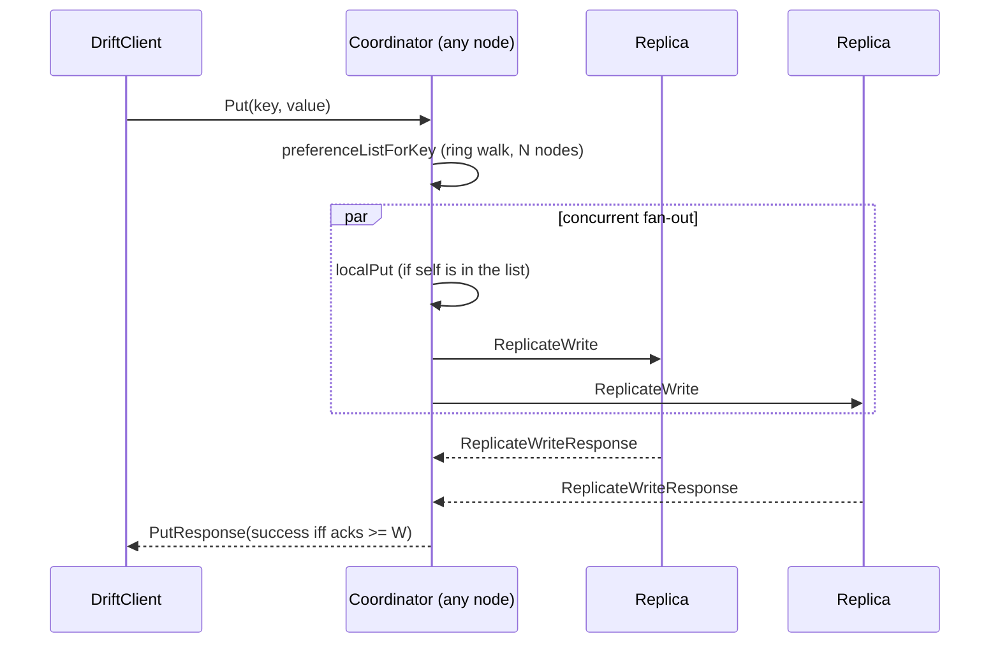

# Driftstore

A leaderless, gossip-coordinated key-value store in C++17 / gRPC. Any node can coordinate a request; data placement uses consistent hashing; writes and reads succeed on a sloppy quorum (`N=3 / W=2 / R=2` by default).

## Why this exists

I built [GTStore](https://github.com/jsampson07/DistributedSystems) first: a sharded, replicated KV store with a centralized manager, static modulo hashing, and a client that wrote directly to all `K` replicas. It worked. It also left a specific question. Systems like Cassandra and DynamoDB reject almost every one of those choices — no manager, no fixed node count, no client-side fan-out, no "block until every replica agrees." I understood that tradeoff from a textbook. I had not built the AP side of it, so I could not say what it actually costs.

Driftstore is the same storage problem with those decisions inverted: gossip instead of centralized heartbeats, consistent hashing instead of modulo, sloppy quorum instead of write-all. The point is not to clone Cassandra. It is to be able to point at a mechanism and say what it buys and what it costs, having built the problem twice.

**Status:** Phases 0–3 are implemented (membership, ring, quorum reads/writes). Vector clocks, hinted handoff, read-repair, the dashboard, and the fault-injection harness are not. No latency or convergence numbers have been measured yet.

## GTStore vs. Driftstore

GTStore is a sibling project: [`jsampson07/DistributedSystems/gtstore`](https://github.com/jsampson07/DistributedSystems/tree/main/gtstore). Same language, same RPC stack, opposite architecture.

| Dimension | GTStore | Driftstore |
|---|---|---|
| Membership | Central manager; cluster shape (`-n`, `-k`) is fixed at start | Gossiped membership table; nodes join via `--seed` |
| Hashing | `hash(key) % num_buckets` in the manager | Consistent hashing + virtual nodes; each node computes its own ring |
| Coordination | Client asks the manager for replicas, then writes to all `K` itself | Client sends `Put`/`Get` to any live node; that node coordinates |
| Consistency | Write-all: success requires every replica to ack; partial writes roll back | Sloppy quorum: success at `W` of `N` writes / `R` of `N` reads (`W+R > N`) |
| Failure handling | Manager pings every storage node; a missed ping remaps ownership | Unreachability is local and does not change the ring; `W < N` lets a write succeed with a replica down |

A write that would fail in GTStore because one replica is down can succeed here. The cost is that replicas can diverge. Nothing in Phases 0–3 reconciles that divergence — that is Phases 4–6.

## Status

| Phase | Description | Status |
|---|---|---|
| 0 | Scaffolding + comparison harness skeleton | ✅ Done |
| 1 | Gossip membership + local failure detection | ✅ Done |
| 2 | Consistent hashing ring + virtual nodes | ✅ Done |
| 3 | Any-node coordinator + basic quorum read/write | ✅ Done |
| 4 | Vector clocks + conflict detection | Planned |
| 5 | Hinted handoff | Planned |
| 6 | Read-repair | Planned |
| 7 | Dashboard | Planned |
| 8 | Fault-injection harness (minimum viable) | Planned |
| 9 | Convergence testing + full comparison run + polish | Planned |

**Done**

- **Phase 0.** One symmetric `node` binary (no manager/storage split). Structured stderr logs. `harness/smoke_test.sh` pings both GTStore and Driftstore.
- **Phase 1.** Push-pull `GossipExchange` of the full membership table; LWW merge; admin `RemoveNode`. A private `unreachable_peers_` set and a `Ping` probe thread exist, and preference-list walks consume that set — but failed gossip/`Put`/`Get` RPCs do not currently call `markUnreachable`, so the set stays empty in a live cluster.
- **Phase 2.** 64-bit ring (`std::map<uint64_t, node_id>`), deterministic vnode tokens, clockwise preference-list walk of `N` distinct physical nodes. Default `V=32`.
- **Phase 3.** `Put`/`Get` on any node; concurrent `ReplicateWrite`/`ReplicateRead` fan-out; quorum counted against `W`/`R`. `DriftClient` round-robins which seed coordinates.

**Planned**

- **Phase 4 — vector clocks.** Concurrent writes through different coordinators currently overwrite a bare string. Without clocks you cannot tell a later write from a concurrent one.
- **Phase 5 — hinted handoff.** Sloppy quorum without hints is an incomplete availability story: a write can succeed with a replica down, and that replica stays stale with no delivery path back.
- **Phase 6 — read-repair.** Hints are not durable (the hint-holder can crash). Repair on read is the backstop that actually converges replicas.
- **Phase 7 — dashboard.** Per-node ring, membership, clocks, and pending hints — the debugging surface Phases 5–6 need, not a storage mechanism.
- **Phase 8 — fault injection.** Kill/restart plus application-level partitions. `kill -9` is already used in harnesses; partitions are not.
- **Phase 9 — comparison run.** Side-by-side GTStore vs. Driftstore under the same failure timing, once there is something to measure.

## Architecture

Every process is the same peer. `node_id` is the `--listen` address (stable across restarts). Storage is an in-memory `std::unordered_map<std::string, std::string>` — no disk, no version field.

### Write path (`Put`)

1. Client sends `Put(key, value)` to any node. `DriftClient` round-robins across its seed list; on a transport failure it walks the remaining seeds for that call only. It does not retry on `success=false`.
2. If the coordinator knows it is `REMOVED`, it refuses (`success=false`, `acks=0`).
3. It computes a preference list: `mix64(fnv1a64(key))`, then walk the ring clockwise collecting `N` distinct physical nodes. `REMOVED` nodes are already absent from `ring_`; the walk also skips any id currently in `unreachable_peers_`.
4. If the list is shorter than `W`, it refuses without dialing anyone.
5. If the coordinator itself is on the list, it `localPut`s first (no self-RPC) and that write counts toward `W`.
6. It fans out `ReplicateWrite` concurrently (`std::async`) to the rest of the list, then waits for **every** launched RPC — not the `W`th ack — before counting. A replica that is itself `REMOVED` returns `success=false` and is not counted.
7. `PutResponse.success` is true iff `acks >= W`.

Internal fan-out sets no RPC deadline on `ReplicateWrite`/`ReplicateRead` (unlike `Ping`'s 500ms probe deadline). A replica that hangs without closing the connection blocks the whole coordinator call.

### Read path (`Get`)

Same preference list, same concurrent fan-out (`ReplicateRead`), same wait-for-all. Success requires `>= R` RPC-ok replies (a replica saying "not found" counts; a failed RPC does not). The value returned is the **first reply to arrive**, not a version comparison — there are no versions yet. If the coordinator holds a replica, its local read is stamped `arrival_order=0` before any remote RPC is launched, so it always wins a disagreement.



### RPCs (`DriftStoreNode` in `src/driftstore.proto`)

| RPC | Caller | What it does |
|---|---|---|
| `Put` / `Get` | Client | Coordinate a quorum write / read |
| `ReplicateWrite` / `ReplicateRead` | Coordinator → replica | Apply or read the local copy |
| `GossipExchange` | Peer → peer | Push-pull the full `MembershipTable` in one round trip |
| `RemoveNode` | Admin (`client --remove=`) | Mark a node `REMOVED`; tokens leave the ring; the tombstone stays |
| `GetStatus` | Admin (`client --status`) | `table_dump` + `ring_dump` |
| `Ping` | `DriftClient::connect`, `client --self`, probe thread | Liveness |

Membership (`UP` / `REMOVED`) is gossiped and eventually converges. Reachability is a separate, local set and is never gossiped — a node being unreachable does not change who owns its keys. Ring membership changes only on an explicit `RemoveNode` (or a join via `--seed` + gossip).

## Design decisions

- **Gossip merge is LWW on `last_updated`, with `writer_id` as tiebreak.** Wall-clock order is not recovered. What is guaranteed: every node computes the same winner regardless of merge order, so the table converges (a state-based LWW register).
- **Gossip is a gRPC RPC, not raw UDP.** SWIM was dropped; Dynamo-style membership is periodic table exchange, which does not need unreliable-transport probing. `GossipExchange` is the same stack as the data path.
- **`W + R > N` is enforced at process start.** Defaults are `3/2/2`. A node with `W+R <= N` (or `W > N`, etc.) refuses to start. `N`/`W`/`R` are per-process flags, not gossiped — every node in a cluster is assumed to be launched with the same values.
- **Vnode tokens are `mix64(fnv1a64(node_id + ":" + i))`, default `V=32`.** Tokens are derived, not random+persisted, so a restart reclaims the same ring positions with no disk. A 5-node / 100k-key sweep (`V ∈ {1,4,16,64,256}`) showed raw FNV-1a clustering sequential vnode strings; a `mix64` finalizer produced a monotonic drop in per-node stddev as `V` grew. `32` is the live default, between the measured 16 and 64 points — not itself a measured optimum.
- **Preference-list reachability is a predicate, not a gossiped status.** `preferenceList()` takes `is_reachable`; membership (`UP`/`REMOVED`) and local reachability stay decoupled. An unreachable node is skipped mid-walk so a later reachable candidate can still fill the `N` slots.
- **A `REMOVED` node refuses `Put`, `Get`, `ReplicateWrite`, and `ReplicateRead`.** It still answers `Ping`, `GetStatus`, and `GossipExchange` — otherwise you could only infer removal from a dropped connection.

## Non-goals

- **The client does not fan out to replicas.** That is GTStore's model. Here the client knows seed addresses; servers compute preference lists.
- **This is not a GTStore clone.** Different proto, different client (`DriftClient`), different process model. The comparison is the point of building both, not API compatibility.
- **No consensus.** Raft / leader election is a separate project. Driftstore is the AP side of the same storage problem; it will not grow a log.

Also out of core scope (see the project plan's stretch list): automatic "presumed dead" ring removal, Merkle-tree anti-entropy, and applying the fault-injection harness back onto GTStore.

## Build and run

Needs g++ (C++17), protobuf, gRPC, and `pkg-config`. `make` builds `bin/node` and `bin/client`. `bin/driftclient` is separate (harness driver, not part of `all`).

```bash
make
make bin/driftclient
```

### Node flags

Parsed in `src/node.cpp` (the usage string does not list every flag):

| Flag | Default | |
|---|---|---|
| `--listen=<addr>` | (required) | Bind address; also the `node_id` |
| `--seed=<addr>[,<addr>...]` | none | Bootstrap via `GossipExchange`; 3 passes, 250ms exponential backoff between passes |
| `--gossip-interval=<ms>` | `1000` | Periodic gossip tick |
| `--probe-interval=<ms>` | `3000` | Probe tick for currently-unreachable peers |
| `--vnodes=<n>` | `32` | Virtual nodes per physical node |
| `--N=` / `--W=` / `--R=` | `3` / `2` / `2` | Quorum; process exits if invalid |

A seedless node is a valid first member. A node given `--seed` that cannot reach any seed exits `1` and does not start its gossip loop.

### Three-node cluster

```bash
./bin/node --listen=127.0.0.1:60061 --N=3 --W=2 --R=2 &
./bin/node --listen=127.0.0.1:60062 --seed=127.0.0.1:60061 --N=3 --W=2 --R=2 &
./bin/node --listen=127.0.0.1:60063 --seed=127.0.0.1:60061 --N=3 --W=2 --R=2 &

./bin/client --target=127.0.0.1:60061 --status
./bin/client --target=127.0.0.1:60061 --put=hello=world
./bin/client --target=127.0.0.1:60062 --get=hello
```

`bin/client` is a debug/admin CLI (`--status`, `--remove=`, `--put=`, `--get=`, plus `--replicate-write=` / `--replicate-read=` which bypass quorum on purpose). `bin/driftclient` is the library driver:

```bash
./bin/driftclient --seeds=127.0.0.1:60061,127.0.0.1:60062,127.0.0.1:60063 \
    --key=hello --value=world --calls=3
```

### Harness

```bash
./harness/test_coordinator_rotation.sh
```

Three nodes (`N=3,W=2,R=2`), kill node C immediately, three `put()`s through one `DriftClient` seeded `[A,B,C]`. All three calls must succeed (`W=2` from the two survivors). Log correlation checks that A coordinated two calls (including the failover from dead C) and B coordinated one.

Other scripts: `smoke_test.sh` (Phase 0 Ping vs. GTStore; needs a built sibling at `../DistributedSystems/gtstore`), `test_replica_boundary.sh`, `verify_remove_reboot.sh`, `run_join_scenario.sh`. Dev binaries: `make bin/test_ring`, `make bin/vnode_experiment`.

Kill stale nodes before a multi-node run — a stopped `gdb` session can hold a listen socket indefinitely (`pkill -9 -f bin/node`). `AddListeningPort`'s success is currently unchecked, so a bind failure is silent.

## Testing and debugging

There is no single thread of execution to step through. A write is a coordinator plus `N` replicas plus gossip on a different interval; `gdb` on one process cannot explain why node C has not seen B's removal. The primary tool is structured logs on stderr:

```
[<ISO8601 UTC, ms>] node=<id> event=<EVENT_TYPE> <key=value ...>
```

Harnesses launch a scenario, then grep correlated lines across per-node files (`PUT_SUCCEEDED key=...`, `REMOVE_SUCCEEDED`, `NODE_REBOOTED`, `table_size=`). `GetStatus` dumps live `table_` / `ring_` for the same reason. `ReplicateWrite`/`ReplicateRead` are intentionally not logged — the coordinator's `Put`/`Get` line is the signal; replica-side lines were judged noise.

## What I'd add next

Phase 4 first: vector clocks, because the current store cannot *detect* or *resolve* a concurrent write. Hinted handoff (5) is next because sloppy quorum without a delivery path back to a down replica is how data stays missing after the replica returns. Read-repair (6) after that, because hints are not a durability guarantee. Dashboard and fault-injection (7–8) last — they are how you watch and stress those mechanisms, not substitutes for them. Automatic ring-removal on prolonged unreachability stays a stretch goal until membership and transient failure are still visibly separate.
